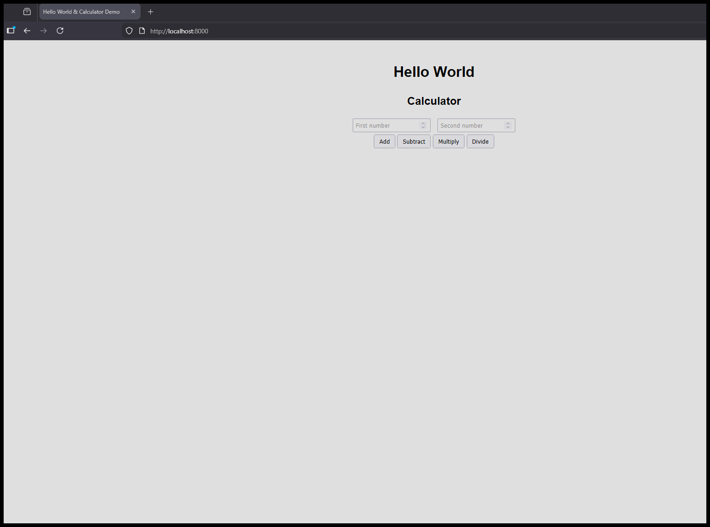
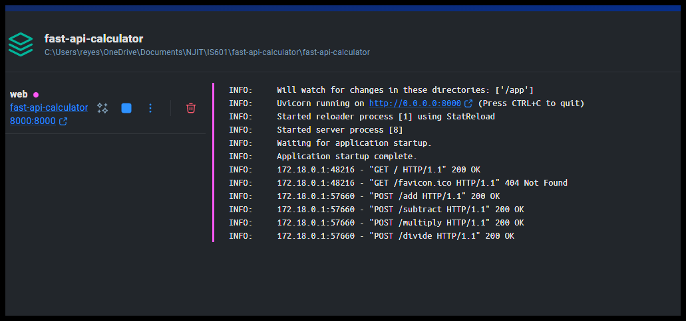
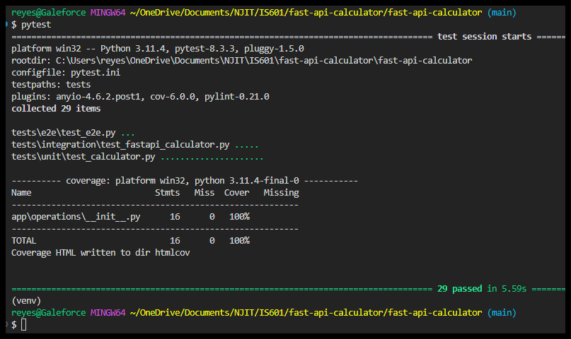
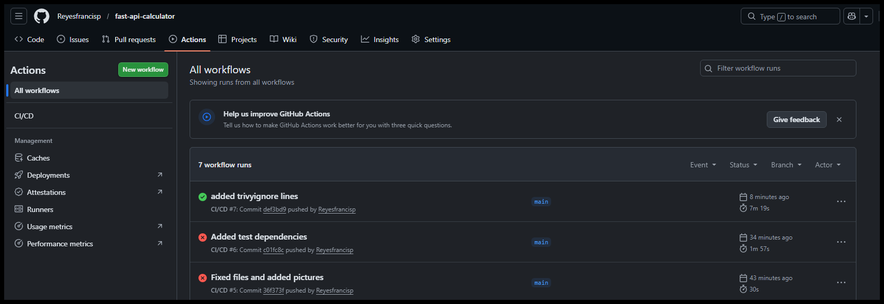

# Fast-api-calculator

Fast API calculator assignment

## Assignment Screenshots

### 1. Application Running in the Browser

### 2. Application Running in Docker

### 3. Passing Tests

### 4. Green Checkmark On Github
